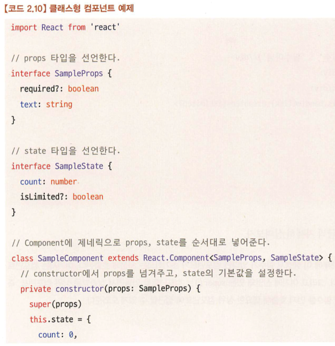

# React.js

## React Elements
기존의 객체지향적인 UI Model은 render시 각 component의 instance들을 appendChild, removeChild, destroy등을 직접 조작해야 하고, 부모 컴포넌트가 자식 컴포넌트의 instance를 직접 생성하고 호출하기 때문에 결합력이 강해진다.

### What is Elements?
- Component instance를 묘사하기 위한 순수 객체
- Instance가 아니며, React가 브라우저에 렌더링하기 위해 필요한 정보를 갖고 있는 JS Object
- Element는 type, props를 갖는다.
- type: string | ReactClass
- props : object
- key, ref
- Element가 HTML Tag일 경우 type은 string이며, props는 tag의 attributes이다.
  ```jsx
  {
    type: 'button',
    props: {
      className: 'button button-blue',
      children: {
        type: 'b',
        props: {
          children: 'OK!'
        }
      }
    }
  }
  <button class='button button-blue'>
    <b>
      OK!
    </b>
  </button>
  ```
- React Component elements일 경우 type은 component 이름, 브라우저가 렌더링을 하기 위한 DOM Tree의 정보
  ```jsx
  {
    type: Button,
    props: {
      color: 'blue',
      children: 'OK!'  // 다른 element를 children으로 갖음으로써 tree 구조를 가질 수 있다.
    }
  }

  const App = ({ content }) => <div>{content}</div>
  ReactDOM.render(<App key="1" content="Deep dive react" />, container)

  const element = {
    // This tag allows us to uniquely identify this as a React Element
    $$typeof: REACT_ELEMENT_TYPE,

    // Built-in properties that belong on the element
    type: type, // function App()
    key: key, // 1
    props: props, // { content: 'deep dive react' }
    ref: ref, // undefined
  }
  ```
- ReactDOM은 props를 component에게 전달하며 return element를 요청한다.
- React의 Renderer는 React Element로부터 정보를 받아 해당 Component에게 정보를 return받는다. 이 과정은 type이 DOM Element(HTML Tag)일 때까지 반복한다.
  - -> Top-down Reconciliation
### What's benefit for doing this?
UI를 렌더링하기 위해 필요한 정보를 React Element만을 갖고 DOM과 독립적으로 UI를 관리할 수 있다. 

## Components
### React Component란?
Props를 받아 Element를 반환하는 것(Functional component 기준)

## Reconciliation

## Fiber
### Fiber Architecture
React는 v16 이전까지는 Reconciler가 Stack 구조를 갖고 렌더링을 하였는데, stack 구조는 rendering이나 작업의 순서를 바꿀 수 없었다. call stack이 비어야(React의 DOM 조작이 끝나야) browser가 렌더링을 시작했다. 이를 개선하기 위해 Fiber를 도입하였다.
### Fiber란?
- V-DOM의 노드 객체이며, React Elements의 내용이 DOM에 반영되기 위한 정보가 확장된 객체.
- React Element에 더해 컴포넌트의 state, life cycle, hook의 정보가 관리된다.
- Update schedule이 끝나면, RootNode는 workInProgress tree를 current tree로 교체하고, 이를 그대로 복사하여 새로운 workInProgress tree로 만든다. 이 과정에서, 복사된 노드끼리 서로 alternate로 참조하고 있다.
[Fiber의 구현 코드](https://github.com/facebook/react/blob/b53ea6ca05d2ccb9950b40b33f74dfee0421d872/packages/react-reconciler/src/ReactFiber.js#L255)
```js
function FiberNode(
  tag: WorkTag,
  pendingProps: mixed,
  key: null | string,
  mode: TypeOfMode,
) {
  // Instance
  this.tag = tag;
  this.key = key;
  this.elementType = null;
  this.type = null;
  this.stateNode = null;

  // Fiber
  this.return = null;
  this.child = null;
  this.sibling = null;
  this.index = 0;

  this.ref = null;

  this.pendingProps = pendingProps;
  this.memoizedProps = null;
  this.updateQueue = null;
  this.memoizedState = null;
  this.dependencies = null;

  this.mode = mode;

  // Effects
  this.effectTag = NoEffect;
  this.nextEffect = null;

  this.firstEffect = null;
  this.lastEffect = null;

  this.expirationTime = NoWork;
  this.childExpirationTime = NoWork;

  // current와 workInProgress는 alternate 주소값으로 서로를 참조하고 있다.
  this.alternate = null;
```

# React 패키지 & 구성 요소
## 구성 요소
### react core
- 컴포넌트를 정의한다.
### renderer
- ReactDOM - Client의 렌더링 환경에 의존. Client와 React를 연결한다.
- reconciler에 의존성을 갖는다.
### event(legacy-events)
- SyntheticEvent - 브라우저의 Event를 wrapping한 확장된 시스템
### scheduler
- React의 비동기 task를 실행.
### reconciler
- React Element를 Fiber로 확장하고, V-DOM을 재조정하며 컴포넌트를 호출하는 곳

## Virtual DOM
실제 DOM과는 달리 메모리상에만 존재하는 가상의 DOM이며, React에서는 V-DOM을 Reconcil하는 것을 Render라고 표현한다.
### 더블 버퍼링
React는 V-DOM을 두개의 트리로 관리하는데, 이를 더블 버퍼링이라고 한다. 하나는 현재 반영된 tree로 current라고 부르며, Render phase ~ Commit phase동안 작업이 진행되는 tree를 workInProgress라고 부른다.
Commit phase가 완료되면 workInProgress tree가 Root node에 연결되어 current가 되며, 교체된 current로부터 자가 복제하여 새로운 workInProgress를 만든다.
V-DOM의 각 fiber 노드들은 current <-> workInProgress를 서로 참조하고 있다.
### What's benefit for V-DOM and double buffering?
UI의 변화가 발생할 때마다 DOM에 Push하고 브라우저가 Paint하게 되면 속도가 느려지고 자원의 소모가 많다. 이를 방지하기 위해 UI의 변화는 V-DOM에서 작업하고, 작업이 완료되면 이를 DOM에 Commit하여 한번에 Paint하는 과정을 거친다.

## Portal
- ReactDOM.createPortal() 로 만들 수 있다. 렌더링할 React element와 이 element가 들어갈 DOM 요소를 인자로 받는다.
- DOM 트리에서는 다른 위치에 있지만, React DOM Tree에서는 위치가 변하지는 않는다. 
### What's benefit for doing this?
- UI가 표시되는 DOM Element의 위치를 다른 곳으로 바꾸지만, 이벤트 버블링은 React DOM Tree 기반으로 발생한다.
- DOM 트리의 최상위에 위치시켜 z-index나 CSS의 적용에 예외를 둘 수 있다.
- 사용 예시 : Toast, Modal, Tooltip, Pop-up 등
```jsx
function App() {
  return (
    <div onClick={() => console.log("div 클릭됨")}>
      부모 div
      <PortalComponent />
    </div>
  );
}

function PortalComponent() {
  return ReactDOM.createPortal(
    <button onClick={() => console.log("버튼 클릭됨")}>Portal 버튼</button>,
    document.body
  );
}
```

React는 v16 이전까지는 Stack 구조를 갖고 렌더링을 하였는데, stack 구조는 rendering이나 작업의 순서를 바꿀 수 없었다. 이를 위해 Fiber를 도입하였다.

## Hook
### Hook은 어디에 있는가?
- Reconciler에 있다. Core package에는 없다. hook은 외부로부터 주입받는데, 그 주입받는 통로가 shared package이다.
- 
### useState를 import하기까지 불러오는 과정
- **reconciler**  
-> ReactFiberHooks.js - **renderWithHooks()**
-> shared/ReactSharedInternals.js  
-> react/ReactSharedInternals.js - ReactCurrentDispatcher  
-> ReactCurrentDispatcher.js - { current: null | Dispatcher }  
-> ReactHooks.js - resolveDispatcher().useState  
-> React.js - export useState  
-> Import { useState } from 'react'

### renderWithHooks()
React의 렌더링을 담당하는 핵심 함수이다. hook과 fiber를 연결해준다.
- current node가 null인지 비교한다.
  - null이라면 mount하고, nextCurrentHook에 null을 할당한다.
  - 아니라면 update하고,  nextCurrentHook에 current.memoizedState를 할당한다. memoizedState에는 hook이 담겨있다.
- Component를 호출한다.
- update 과정이라면 if (didScheduleRenderPhaseUpdate) 부분에서 scheduler에게 업데이트 관련 정보를 넘긴다.
  - dispatchAction()에서 didScheduleRenderPhaseUpdate를 render phase upder라면 true로 조작한다.

### refs
- JS의 pure object로, escape hatch이다. useState와 마찬가지로 값을 저장하고 읽을 수 있지만, rendering trigger에 관여되지 않는다. mutable이기 때문에 변경에 대해 예측할 수 없으므로, 렌더링 시 값을 읽으면 안된다. 

### Transition hook
React v18부터 정식으로 추가된 기능이다. 이 기능으로 React에 rendering의 긴급도를 알려줄 수 있다.
startTransition으로 wrapping된 업데이트는 긴급하지 않은 업데이트로 취급되며, 다른 긴급한 업데이트가 발생하면 중단되고, 완료되지 않은 오래된 렌더링 작업을 버리고 최신 업데이트만 render한다.  
사용 예시로는 검색창에 text를 입력시 아래에 렌더링되는 자동완성 기능이 있다. 사용자의 입력값은 즉각적으로 업데이트 되어야 하지만, 자동 완성 결과에 대해서는 렌더링이 느리더라도 허용할 수 있다.  
하지만, 동기적인 UI 업데이트(useState)에는 사용할 수 없다.

#### What's benefit for this?
- 비동기 작업이 진행되는 동안 기존의 UI를 유지한다.
- 기존에도 useState를 두개로 분리하거나, setTimeout을 사용하여 slow rendering을 구현할 수 있었다. 다만 여기서 발생하는 문제는, 변화하는 모든 UI에 대해 렌더링이 발생된다는 것이다.
- non-blocking task로, 중간에 렌더링 작업을 취소할 수 있다.
- transition을 사용하여 최신 업데이트에만 rendering을 할 수 있으며, useTransition hook을 사용하여 pending에 대한 UI 표현도 가능해졌다.
- startTransition을 통해 명시적으로 비동기 작업을 trigger한다.

#### What's difference with useDefferedValue hook?
- useDefferedValue hook은 해당 value가 변경되어 UI가 업데이트될 때 Suspense에 잡히지 않고, 기존의 value로 렌더링된 UI를 보여준다. 그 후 백그라운드에서 업데이트된 값으로 리렌더링을 시도한다. 이 리렌더링은 완료되기 전에 다시 value가 변경되면 렌더링을 버리고 새로운 값으로 다시 리렌더링을 시작한다.
- useDefferedValue에서 보여줄 기존의 UI는 반드시 memo로 감싸져있어야 한다. 변하기 전의 값에 대한 UI를 기억하고 있어야 하기 떄문이다.
- 동기적으로 변하는 값에 대해 렌더링을 지연시킨다.

#### What's difference with Suspense?
- Suspense는 자식 요소가 렌더되기 전까지 대체 UI를 보여준다. children이 렌더링되는 동안 fallback을 렌더링하여 보여준다.
- 이는 기존의 값을 이용한 UI를 보여주느냐, fallback을 보여주느냐에 대한 선택의 차이이다.

```jsx
import { useState, useDeferredValue } from 'react';
import SlowList from './SlowList.js';

export default function App() {
  const [text, setText] = useState('');
  const deferredText = useDeferredValue(text);
  return (
    <>
      <input value={text} onChange={e => setText(e.target.value)} />
      <SlowList text={deferredText} />
    </>
  );
}
```


```jsx
import { startTransition } from 'react';

// Urgent: Show what was typed
setInputValue(input);

// Mark any state updates inside as transitions
startTransition(() => {
  // Transition: Show the results
  setSearchQuery(input);
});
```
```jsx
import { useTransition } from 'react';

const [isPending, startTransition] = useTransition();

return {isPending && <Spinner />}
```

---

## 종합

- **ReactDOM.createRoot()**
    
  [참고 - https://ko.legacy.reactjs.org/docs/react-dom-client.html](https://ko.legacy.reactjs.org/docs/react-dom-client.html)
    
  React 18부터 도입된 메서드이다. React 앱을 초기화하고 앱의 렌더링 위치를 지정하는 단계이다.
    
  ```jsx
  const rootElement = document.getElementById("root");
  const root = ReactDOM.createRoot(rootElement);
  ```
    
  그 이전에는 아래와 같이 사용했다.
    
  ```jsx
  const rootElement = document.getElementById("root");
  ReactDOM.render(<App />, rootElement);
  ```
    
  ### 무엇이 다른가?
    
  createRoot()를 사용하면 성능과 반응성이 향상된다.
    
  1. Concurrent Mode (병렬 모드) - React 앱이 병렬 모드를 활용한다.
    - 병렬 모드란? - 우선순위에 따라 렌더링을 관리한다. 중요한 컨텐츠를 먼저 렌더링하여 더 빠른 반응성을 제공한다. 예) 버튼을 클릭하면 해당 이벤트 핸들러를 우선순위로 처리하여 빠르게 응답하고, 낮은 우선순위의 작업들은 백그라운드에서 처리
- **리액트 엘리먼트란?**
    
  **JS코드와 HTML 태그들의 조합으로, 표시할 내용을 설명한다. 화면에 표시하려는 객체이다**. UI의 가장 작은 단위. 메모리상에 존재하는 Virtual DOM의 가상 객체이며, React DOM에 렌더할 때 사용된다. HTML 태그 형식을 가지며 JSX문법을 사용하여 생성된다.
    
- **리액트 컴포넌트란?**
    
  React가 브라우저에 렌더링하는 일부 마크업을 표함할 수 있는 JS함수. **UI를 표시하는 재사용 가능한 코드 조각.** 
    
  엘리먼트를 반환하는 함수 또는 클래스로 정의된다. 컴포넌트는 고유한 로직과 모양을 가진 UI(사용자 인터페이스)의 일부입니다. 특정 작업을 수행하거나 UI를 렌더링하는데 사용된다. 엘리먼트의 집합으로 구성될 수 있다. 컴포넌트는 버튼만큼 작을 수도 있고 전체 페이지만큼 클 수도 있습니다.
    
- **JSX란?**
    
  React를 사용하기 위한 자바스크립트 확장 문법으로, React 엘리먼트를 만든다. HTML과 JS를 함께 사용할 수 있다. JSX는 하나로 감싸진 HTML 태그를 리턴하며, Babel에 의해 JS로 변환된다. 그러므로 하나의 함수에서 두개의 객체를 반환할 수 없다. 또, 하나의 태그여야 하는 이유는 Virtual DOM이 Diffing을 쉽게 하기 위함이다.
    
  - Javascript를 확장한 문법이다. JSX는 React Element를 생성한다. 리액트는 컴포넌트에 마크업을 넣는다.
  - 중괄호 안에 모든 JS 표현식을 넣을 수 있다.
  - Babel은 JSX를 React.createElement() 호출로 컴파일한다. 이러한 객체를 React 엘리먼트라고 부른다.
    
  **React JSX에서 if문, for문 등을 사용할 수 없는 이유**
    
  ~~문(statement)는 결과를 반환하는 식(expression)이 아니라, 조건에 따라 코드 실행을 제어하는데 사용되기 때문.
    
- **Key란?**
    
  컴포넌트가 배열로 반복될 때, 각 항목을 구분할 수 있는 고유한 key를 전달하여야 한다. React가 항목을 업데이트할 때 키를 사용한다. 입력하지 않을 경우 배열의 index를 기본으로 사용하지만, 이는 안전한 방법은 아니다.
    
  형제간에 고유해야 한다. 다른 배열의 JSX 노드에는 동일한 key도 상관 없다. key는 변경되지 않아야 한다. 렌더링 중 생성하면 안된다.
    
- **Props란?**
    
  React 컴포넌트 함수는 하나의 인자 props만을 받는다. 부모 컴포넌트가 자식 컴포넌트에게 전달하는 정보로 객체, 배열, 함수 등 모든 JS값을 전달할 수 있다. 단, 자식이 부모에게 전달할 수는 없다.
    
  Props는 불변해야하며(READ ONLY), 컴포넌트가 props를 변경해야 하는 경우 부모 컴포넌트가 새로운 props 객체를 전달하도록 요청해야 한다. 그렇게 하면 GC가 이전 props의 메모리를 회수한다. 
    
  ```tsx
  function Foo({ property1, property2 = 100 }: { ..., ... }) {
    return (
      <Bar {...props}>  // but not recommended
    )
  }
  ```
    
- **<StrictMode>**
    
    버그를 조기에 발견할 수 있다. 어떻게?
    
    개발 전용 동작을 활성화한다.
  
  1. 불완전한 렌더링으로 인한 버그를 찾기 위해 한번 더 렌더링한다.
        
    React는 모든 컴포넌트가 순수한 함수라고 가정한다. 이 순수성이 위반되는 경우를 찾기 위해 렌더링을 2번 한다. 렌더링될 때마다 외부의 상태가 변경되어 의도와 다른 결과를 찾아낸다. 문제가 없다면 2번 렌더링 되어도 같은 입력 → 같은 출력을 확인할 수 있다.
        
    **2번 렌더링되는 조건들**
    
    - **useState, set, useMemo, useReducer**에 전달한 함수
    - constructor, render, shouldComponentUpdate 등의 클래스 컴포넌트 메서드
  2. Effect 클린업이 누락되어 발생한 버그를 찾기 위해 Effect를 한번 더 실행한다.
        
    React는 컴포넌트가 마운트(화면에 추가)될 때 셋업을 호출하고, 해제될 때 클린업을 호출한다. StrictMode에선 셋업+클린업을 2회 실행한다. 이로 인해 클린업이 잘 되는지 확인할 수 있다.
        
  3. 지원 중단된 API의 사용 여부를 확인한다.
- **순수성**
    
  React는 모든 컴포넌트를 순수한 함수로 취급한다.
    
  **순수한 함수란?**
    
  - 계산만 수행하고 그 이상은 수행하지 않는다. 호출되기 전에 존재했던 객체나 변수를 변경하지 않는다.
  - 동일한 입력이 주어지면 항상 동일한 결과를 반환한다.
    
  즉, React 컴포넌트는 동일한 입력이 주어지면 항상 동일한 JSX를 반환해야한다. 오직 JSX만을 반환해야 하며, 렌더링 전에 존재했던 객체나 변수를 변경하면 안된다.
    
  이 순수성을 위해 외부의 객체를 prop으로 전달하여 외부에 영향을 직접적으로 주지 않는다. **props, state, context**는 읽기 전용이다. 단, Local scope 내에서 변하는 ‘지역 변이’는 괜찮다.
    
  입력이 변경되지 않은 컴포넌트는 렌더링을 건너뛴다. 순수 함수는 항상 동일한 결과를 반환하므로 입력값이 변하지 않았다면 항상 동일한 결과를 반환하므로 캐싱에서 안전하다.
    
- **Side Effects**
    
  화면 업데이트, 데이터 변경 등 부수적으로 일어나는 일이다. React의 사이드 이펙트들은 보통 이벤트 핸들러에 속한다. 이벤트 핸들러는 컴포넌트 내부에 정의되어 있어도, 렌더링 중에는 실행되지 않는다. 그러므로 이벤트 핸들러는 순수할 필요가 없다.
    
  컴포넌트가 렌더링에 사용하는 어떤 입력값도 변이하면 안된다. 화면을 업데이트하려면 기존 객체를 변이하는 대신 setState를 사용해야 한다.
    
- **엘리먼트 렌더링**
    
  엘리먼트는 React 앱의 가장 작은 단위이다. 화면에 표시할 내용을 기술한다.
    
  ```jsx
  const element = <h1>This Is Element.</h1>
  ```
    
  엘리먼트는 컴포넌트의 구성 요소이다. 브라우저의 DOM 엘리먼트와 달리 React 엘리먼트는 일반 객체이며, React DOM이 React 엘리먼트와 일치하도록 DOM을 업데이트한다.
    
- **React의 불변성**
    
  부모 컴포넌트의 state가 변경되면 모든 자식 컴포넌트들도 변경사항이 없더라도 리렌더링된다. 여기서 불변성을 사용하면 컴포넌트가 데이터의 변경 여부를 알기 쉬우므로, 리렌더링을 피할 수 있다.
    
- **리액트의 선언적 코드 패러다임**
- **렌더링 프로세스**
  - React에서 렌더링은 DOM 업데이트가 아니라 그 과정을 시작하는 단계이다.
  1. Trigger - 렌더링 촉발
    - state가 변경되었을 경우 작동. Object.is() 메서드를 사용해 state값이 불변을 지켜 대체되었는지 확인한다.
    - 리렌더링이 되는 조건은 부모 컴포넌트의 리렌더링, state변경, contextAPI의 state변경이다.
  2. Rendering - 컴포넌트 렌더링
  3. Commit - DOM에 커밋
- **memo**
    
  리액트는 기본적으로 컴포넌트가 리렌더링될 때 그 자식 컴포넌트들까지 모두 리렌더링을 한다. memo를 사용하면, **props**가 변하지 않았을 경우 부모에 의한 재렌더링을 막을 수 있다.
  단, state가 변하는 경우는 리렌더링된다.
    

### **클래스 컴포넌트**

```tsx
import React from 'react'

class SampleComponent extends React.Component {
  render() {
    return <h1>Sample</h1>
  }
}
```

- 클래스 컴포넌트에서 extend할 수 있는 클래스는 React.Component / React.PureComponent 이다. 이 둘의 차이는 shouldComponentUpdate를 다루는데 있다.
- 예제
    
  
    
  
    
- 클래스의 constructor에서 컴포넌트의 state를 초기화할 수 있다.
- props : 본 컴포넌트를 호출할 때 필요한 props의 정보
- state : 컴포넌트 내부에서 관리하는 값. 항상 객체여야 하며, 이 값에 변화가 있을 때마다 리렌더링된다.

### 생명 주기

마운트 : 컴포넌트가 생성되는 시점

업데이트 : 이미 생성된 컴포넌트의 내용이 변경되는 시점

언마운트 : 컴포넌트가 더이상 존재하지 않는 시점

- render () : 마운트, 업데이트에서 일어난다. 항상 순수해야 한다.
- componentDidMount() : 컴포넌트가 마운트되고 준비가 됐다면 그 다음으로 호출되는 생명주기 메서드. 마운트되는 즉시 실행된다. 호출되며 state를 변경한다면 다시 한번 렌더되어야 하지만, 이는 DOM 업데이트 전에 실행되므로 보여지지 않는다.
- componentDidUpdate() :
- getDerivedStateFromError() : 하위 컴포넌트에서 에러가 발생했을 경우 어떻게 자식 컴포넌트를 렌더링할지 결정하는 용도이다. 반드시 미리 정의해둔 state 값을 반환해야 한다.
- componentDidCatch () : 자식 컴포넌트에서 에러가 발생했을 때 getDerivedStateFromError()에서 state를 결정한 이후 실행된다.
- 리액트 생명주기 다이어그램
    
  
    
- **useState**
  - useReducer로 구현되어 있으며, 실제 내부 코드는 비공개이다. 클로저를 통해 값을 참조 및 변경할 수 있다.
  
  Lazy Initialization
    
  - useState의 초기값으로 값을 반환하는 함수를 넣는다면, 이 함수는 state가 처음 만들어질 때만 사용된다. 리렌더링시에는 이 함수의 실행은 무시된다.
- **useEffect**
    
  렌더링할 때마다 의존성에 있는 값을 비교하면서, 이 값이 달라진 경우 부수 효과를 실행하는 함수.
    

### Think in React

### State로 분류하는 기준

state는 컴포넌트의 메모리와 같다. 컴포넌트가 일부 정보를 계속 추적하고 상호작용하여 변화할 수 있다.

- 시간에 따라 바뀌고, 다른 것으로부터 계산할 수 있으면 state이다.
  - 시간이 지나도 변하지 않으면 state가 아니다.
- 부모로부터 props를 통해 전달되면 state가 아니다.
- 컴포넌트의 기존 state 또는 props를 가지고 계산할 수 있다면 state가 아니다.

### State가 어디에 있어야 할지 파악하기

- state를 변경하는데 책임이 있는 컴포넌트, 즉 state를 소유하는 컴포넌트를 식별해야 한다.
- 해당 state를 기반으로 렌더링하는 모든 컴포넌트를 찾는다.
- 가장 가까운 공통 상위 컴포넌트, 계층상 그 state의 영향을 받는 모든 컴포넌트들의 위에 있는 컴포넌트를 찾는다.
- state의 위치를 결정한다. 대개 공통 부모에 state를 둔다.
